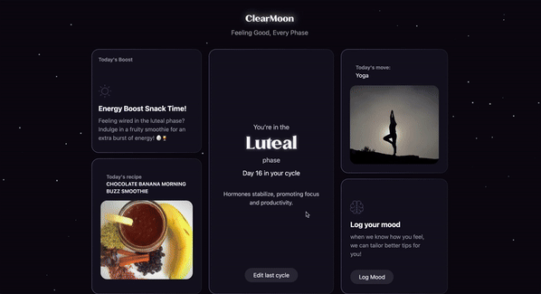
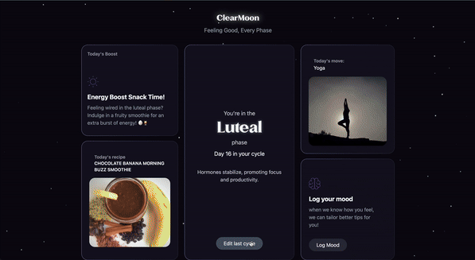
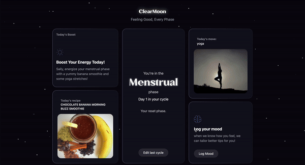

# ClearMoon

ClearMoon is a health-focused web application designed to support women in understanding and managing their menstrual cycle. The application provides personalized recommendations for fitness, nutrition, and symptom management based on the user’s cycle phase. This is a project done under CodeOp Front-End Bootcamp.

## Features

- **Cycle Tracking**: Log your last cycle to get your cycle phase.
- **Daily Tip**: Log your mood and get a tip, recipe, and a move recommendation to improve your day.
- **Minimalist Design**: A clean and simple interface designed for ease of use.
- **Responsive Layout**: Fully optimized for both desktop and mobile users.

## Technology Stack

- **Frontend**: Vue.js (v3), Tailwind CSS
- **APIs**: Hugging Face for AI responses, Spoonacular for recipes, Unsplash for images

## Getting Started

### Installation

1. Clone the repository:

   ```bash
   git clone https://github.com/angelesgonzalez/ClearMoon.git
   cd ClearMoon
   ```

2. Install dependencies:

   ```bash
   npm install
   ```

3. Start the development server:

   ```bash
   npm run dev
   ```

4. Create API keys for:
   - Spoonacular
   - Hugging Face
   - Unsplash

5. Update API keys in your `.env.local` file:

   ```env
   VITE_SPOONACULAR_API_KEY=your_spoonacular_key
   VITE_HUGGINGFACE_API_KEY=your_huggingface_key
   VITE_UNSPLASH_API_KEY=your_unsplash_key
   ```

### Screenshots






